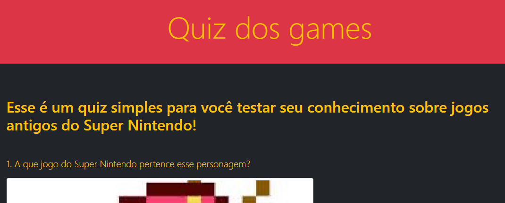

<h1>:link: Quiz Interativo</h1>

  Este repositório foi criado com a intenção de divulgar meus aprendizados em JavaScript, através do Curso de JavaScript Roger Melo.

  O objetivo do projeto foi criar um quiz de games, a cada resposta correta você ganha X pontos.

 

<h2>:link: Layout do projeto</h2>

 

<h2>:link: Tecnologias utilizadas</h2>
<ul>
 <li>HTML</li>
 <li>CSS</li>
 <li>JavaScript</li>
 <li>Bootstrap</li>
</ul>

 

<h2>:link: Autor</h2>

<h4>Rafael Prado de Jesus</h4>

  
  
  
  
  

